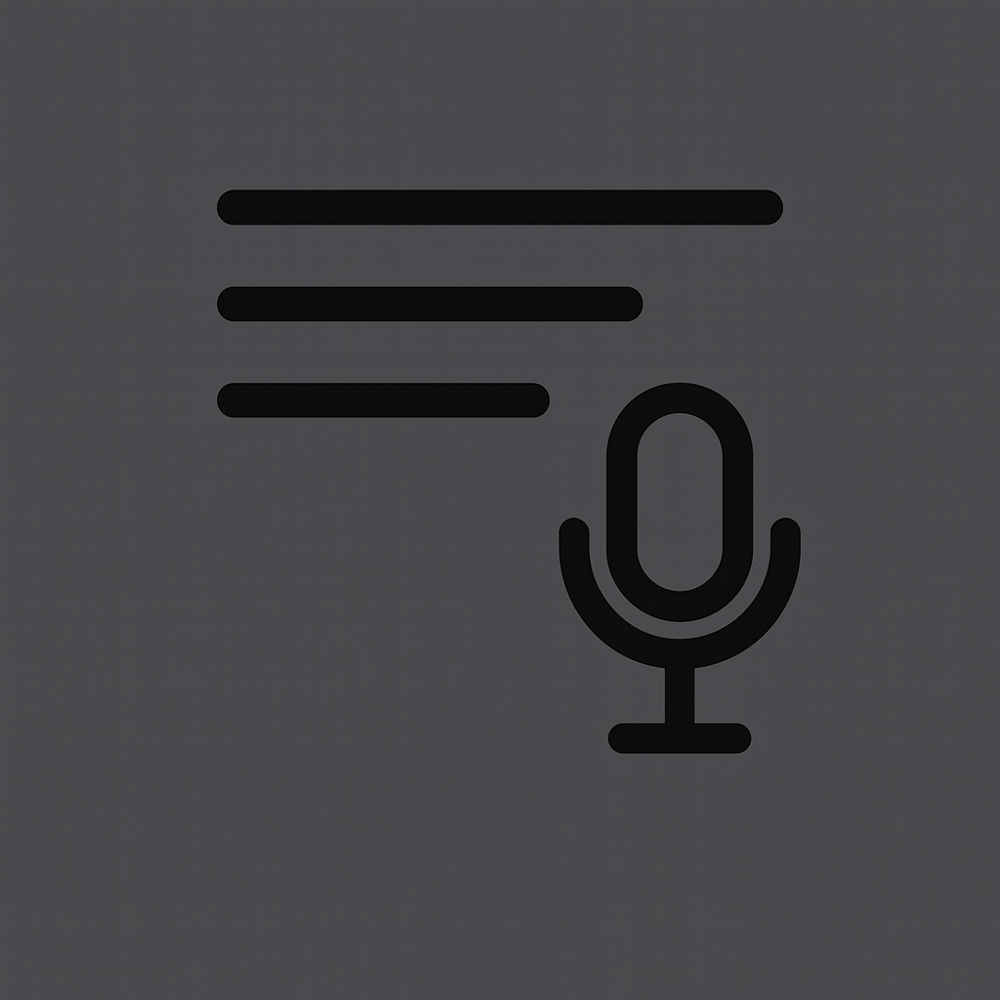
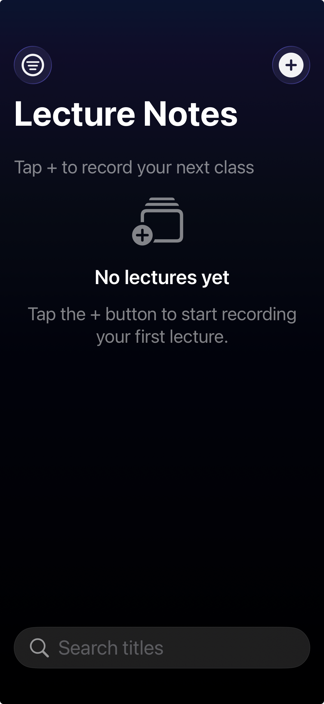
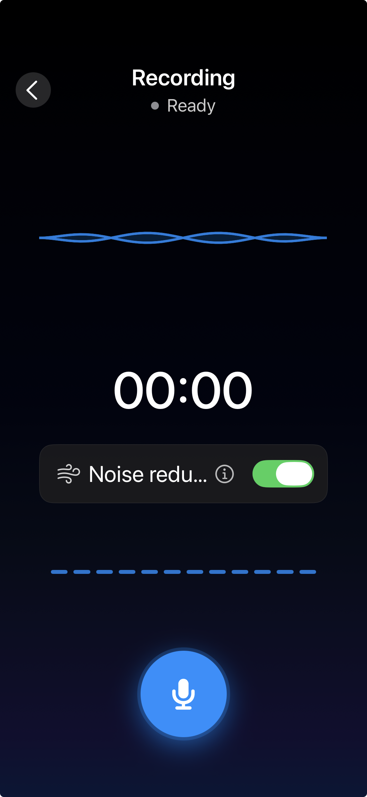
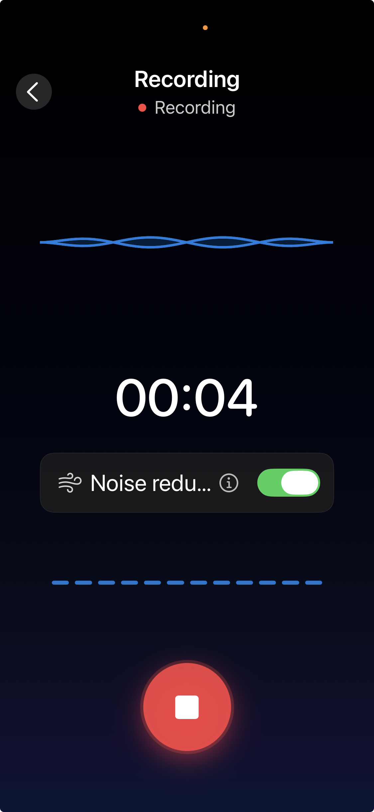
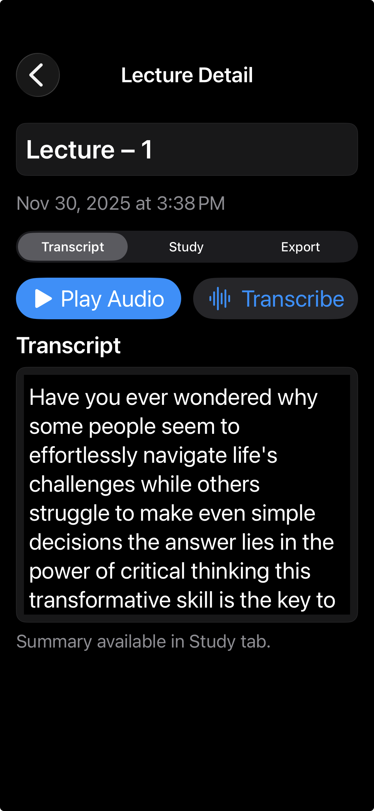
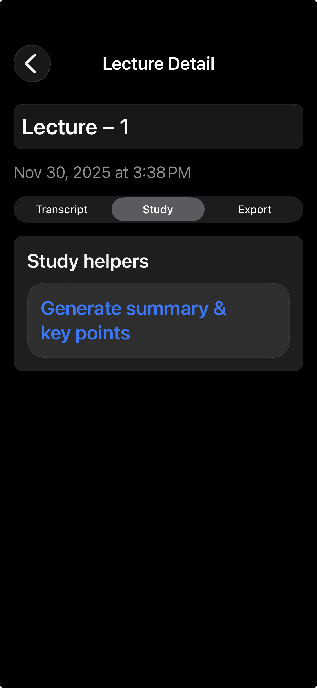

# NotesAssistant

NotesAssistant captures lectures, applies noise reduction, transcribes audio, and provides study helpers like summaries and key points.

## Features
- Record lectures with a noise reduction toggle and live mic-level visuals.
- Transcribe recordings and export transcript, audio, or PDF.
- Study helpers to generate summaries and key points.
- Organized lecture list with filters and search.

## Project structure
- SwiftUI app entry: `NotesAssistant/NotesAssistantApp.swift`
- UI features under `NotesAssistant/Features/` (Recording, NotesList, LectureDetail).
- Services: `NotesAssistant/Services/` (audio recording, transcription, summary, PDF export).
- Shared theme and utilities: `NotesAssistant/Support/`.
- Tests: `NotesAssistantTests/`.

## Development
- Open in Xcode: `xed NotesAssistant.xcodeproj`
- Build (CI-friendly): `xcodebuild -scheme NotesAssistant -destination 'platform=iOS Simulator,name=iPhone 16' build`
- Tests: `xcodebuild test -scheme NotesAssistant -destination 'platform=iOS Simulator,name=iPhone 16'`
- Optional formatting: `swiftformat NotesAssistant`

## Permissions
- Microphone: recording and noise reduction.
- Speech recognition: transcription.

## Screenshots
<table>
  <tr>
    <td></td>
    <td></td>
    <td></td>
  </tr>
  <tr>
    <td></td>
    <td></td>
    <td></td>
  </tr>
</table>
